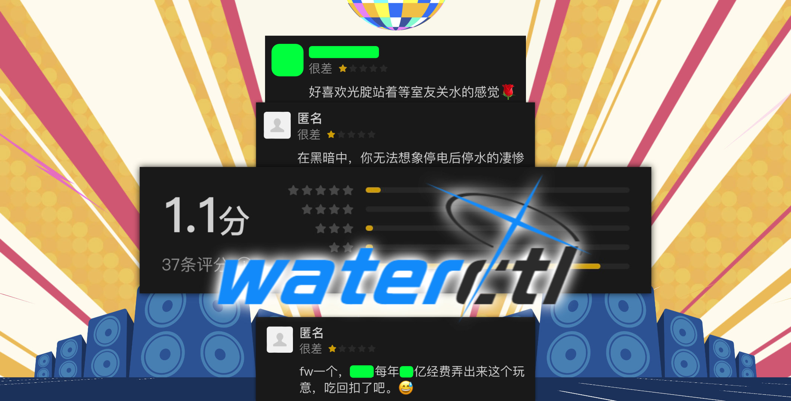

<div align="center">

# 🛀 蓝牙水控器 React Native

<h3>
    现代化的智能水控器移动应用 | 开源项目
</h3>

[](https://github.com/E7G/waterctlrn/blob/main/LICENSE)
[](https://reactnative.dev/)
[](https://developer.android.com/index.html)
[](https://developer.apple.com/ios)

<p>基于 React Native 开发的蓝牙水控器应用，支持 Android 和 iOS 平台<br/>本项目是 <a href="https://github.com/celesWuff/waterctl">原版水控器项目</a> 的跨平台实现</p>

<p>
    <a href="#-特性">特性</a> •
    <a href="#-快速开始">快速开始</a> •
    <a href="#-发布应用">发布</a> •
    <a href="#%EF%B8%8F-配置说明">配置</a> •
    <a href="#-常见问题">FAQ</a>
</p>

[](waterctl.jpg)

</div>

## ✨ 特性

<table>
<tr>
    <td>
        📱 <b>跨平台支持</b><br/>
        同时支持 Android 和 iOS 设备
    </td>
    <td>
        🌐 <b>完全离线运行</b><br/>
        无需互联网连接
    </td>
    <td>
        🔄 <b>自动重连功能</b><br/>
        解决蓝牙连接断开问题
    </td>
</tr>
<tr>
    <td>
        ⚡ <b>快速响应</b><br/>
        优化的蓝牙通信机制
    </td>
    <td>
        🎨 <b>现代化界面</b><br/>
        符合各平台设计规范的 UI
    </td>
    <td>
        🔒 <b>安全可靠</b><br/>
        使用原生蓝牙 API，无需 Root
    </td>
</tr>
</table>

## 🚀 快速开始

<details>
<summary>📋 环境要求</summary>

- Node.js >= 18
- React Native 开发环境
- Android Studio (Android 开发)
- Xcode (iOS 开发，仅 macOS)
</details>

### 📥 安装步骤

1️⃣ 克隆仓库：
```bash
git clone https://github.com/yourusername/waterctlrn.git
cd waterctlrn
```

2️⃣ 安装依赖：
```bash
npm install
# 或者使用 yarn
yarn install
```

3️⃣ iOS 额外步骤（仅限 macOS）：
```bash
cd ios && pod install && cd ..
```

### ▶️ 运行应用

<table>
<tr>
<th>Android</th>
<th>iOS</th>
</tr>
<tr>
<td>

```bash
npm run android
# 或
yarn android
```

</td>
<td>

```bash
npm run ios
# 或
yarn ios
```

</td>
</tr>
</table>

## 📱 发布应用

<details>
<summary>📦 Android 应用发布</summary>

1. 设置签名配置：
   - 复制 `android/gradle.properties.example` 到 `android/gradle.properties`
   - 在 `android/gradle.properties` 中配置您的签名信息

2. 生成发布包：
```bash
npm run release
# 或
yarn release
```

生成的 APK 文件位于 `android/app/build/outputs/apk/release/` 目录。
</details>

<details>
<summary>🍎 iOS 应用发布</summary>

请参考 [React Native 官方文档](https://reactnative.dev/docs/publishing-to-app-store) 进行 iOS 应用的发布。
</details>

## ⚙️ 配置说明

<details>
<summary>📱 蓝牙设备配置</summary>

在 `src/bluetooth.ts` 中找到设备名称配置：

```typescript
// 设备常量
export const DEVICE_NAME = "Water36088";
const DEVICE_ADDRESS = "6D:6C:00:02:73:63";
```

将 `Water36088` 替换为您的水控器蓝牙设备名称。
将 `6D:6C:00:02:73:63` 替换为您的水控器蓝牙设备蓝牙地址。
</details>

<details>
<summary>🔄 自动重连配置</summary>

可以在 `src/bluetooth.ts` 中调整重连相关的参数：
- 重连间隔时间
- 最大重试次数
- 连接超时时间
</details>

## 🤝 贡献指南

我们欢迎所有形式的贡献，无论是新功能、bug 修复还是文档改进！

1. Fork 本仓库
2. 创建特性分支：`git checkout -b feature/AmazingFeature`
3. 提交更改：`git commit -m 'Add some AmazingFeature'`
4. 推送分支：`git push origin feature/AmazingFeature`
5. 提交 Pull Request

## 📝 常见问题

遇到问题？我们为您准备了详细的 [FAQ](FAQ.md) 文档，涵盖了常见问题和解决方案。

## 📜 开源许可

本项目采用 [MIT 许可证](LICENSE) 进行开源。

## 🙏 致谢

<table>
<tr>
<td align="center">
    <a href="https://github.com/celesWuff/waterctl">
        
        <br />
        <sub><b>原始项目</b></sub>
    </a>
</td>
<td align="center">
    <a href="https://github.com/innoveit/react-native-ble-manager">
        
        <br />
        <sub><b>蓝牙通信库</b></sub>
    </a>
</td>
</tr>
</table>

---

<div align="center">

如果这个项目对您有帮助，请考虑给它一个 ⭐️

</div>
